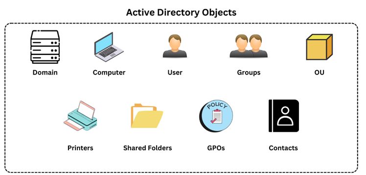

## Overview
In an Active Directory (AD) environment, we often refer to various resources as **objects**. An object can represent any resource within the AD environment, such as Organizational Units (OUs), printers, users, and domain controllers.

### Key Points:
- **Objects**: Any resource within AD like OUs, printers, users, and domain controllers.
- **Leaf Objects**: These objects cannot contain other objects (e.g., users, printers).
- **Container Objects**: These can hold other objects (e.g., groups, OUs).

## AD Objects

### 1. Users
- **Description**: Users are the individuals within an organization's AD environment.
- **Type**: Leaf objects (cannot contain other objects).
- **Attributes**: Many attributes like display name, last login time, email address, account description, manager, etc.
- **Security Principal**: Has a Security Identifier (SID) and a Global Unique Identifier (GUID).
- **Importance**: They are prime targets for attackers since gaining access to even a low privileged user can grant access to many objects and resources.

### 2. Contacts
- **Description**: Contact objects are used to represent external users or entities (e.g., third-party vendors or customers).
- **Type**: Leaf objects (cannot contain other objects).
- **Attributes**: Include first name, last name, email address, phone number, etc.
- **Security Principal**: Not a security principal; does not have an SID but has a GUID.

### 3. Printers
- **Description**: Printer objects point to printers accessible within the AD network.
- **Type**: Leaf objects (cannot contain other objects).
- **Attributes**: Printer name, driver information, port number.
- **Security Principal**: Not a security principal; only has a GUID.

### 4. Computers
- **Description**: Represents any computer (workstation or server) joined to the AD network.
- **Type**: Leaf objects.
- **Security Principal**: Considered a security principal and has a SID and GUID.
- **Importance**: Computers are targets for attackers as full administrative access can give attackers control over a large number of domain resources.

### 5. Shared Folders
- **Description**: Shared folder objects point to shared folders on specific computers.
- **Type**: Leaf objects.
- **Attributes**: Includes the name, location, security access rights, and more.
- **Security Principal**: Not a security principal; only has a GUID.

### 6. Groups
- **Description**: Groups are used to manage user permissions and access to securable objects.
- **Type**: Container objects (can contain other objects, including users, computers, and other groups).
- **Security Principal**: Has a SID and a GUID.
- **Nested Groups**: Groups can be nested within other groups, allowing users to inherit permissions from parent groups. This can sometimes lead to unintended access rights.
- **Example**: A group can contain multiple users and give them access to a shared resource. Nested groups help manage complex permissions across different departments.

### 7. Organizational Units (OUs)
- **Description**: OUs are containers used by system administrators to group similar objects for ease of management and delegation.
- **Use Cases**: OUs help in delegating administrative tasks (e.g., resetting passwords, modifying group membership) without granting full administrative rights.
- **Security Principal**: Not a security principal.
- **Attributes**: Name, members, security settings, etc.
- **Group Policy**: OUs play an essential role in applying specific Group Policy settings, such as password policies, for particular user groups.

### 8. Domain
- **Description**: A domain is the structure that organizes objects such as users and computers.
- **Attributes**: Domains contain groups, OUs, and other objects. Each domain has its own set of policies and database.
- **Importance**: Domains help manage access to resources and enforce security policies like password complexity.

### 9. Domain Controllers
- **Description**: Domain controllers are the servers that authenticate and verify users and computers in the domain.
- **Importance**: They handle all access requests and enforce security policies.

### 10. Sites
- **Description**: Sites are groups of computers connected by high-speed links and are used to make replication between domain controllers efficient.
- **Use Case**: Sites help manage traffic and replication between AD controllers over large geographical areas.

### 11. Built-in
- **Description**: A built-in container holds default groups that are predefined when an AD domain is created.
- **Use Case**: These groups have predefined access rights for users and computers.

### 12. Foreign Security Principals (FSPs)
- **Description**: FSPs represent objects from external forests added to a group in the current domain.
- **Attributes**: Holds the SID of a foreign object.
- **Use Case**: FSPs are used when objects from other forests are added to the AD domain.

## Conclusion
Active Directory (AD) objects are the foundation of an AD environment, and understanding these objects—along with their attributes and security roles—is crucial for managing and securing the network. AD provides powerful tools for organizing and controlling access to resources, but improper configuration or misuse of objects can lead to security vulnerabilities.
