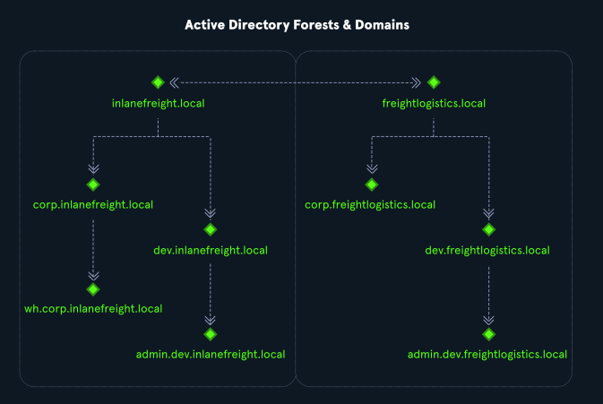

## What is Active Directory (AD)?
- Active Directory (AD) is a **directory service** for **Windows network environments**.
- It provides a **distributed**, **hierarchical** structure for **centralized management** of:
  - Users
  - Computers
  - Groups
  - Network devices and file shares
  - Group policies
  - Servers and workstations
  - Trusts
- AD offers **authentication** and **authorization** functions within a **Windows domain environment**.

## Active Directory Domain Services (AD DS)
- **AD DS** stores directory data and makes it available to both **standard users** and **administrators**.
- It stores information such as:
  - Usernames
  - Passwords
  - Rights and permissions for accessing resources
- First shipped with **Windows Server 2000**.
- Designed to be **backward-compatible**.
- Not **"secure by default"** — can be difficult to manage in large environments.

## Security Concerns
- **Active Directory flaws and misconfigurations** can:
  - Provide attackers a foothold into the internal network.
  - Allow lateral and vertical movement.
  - Lead to unauthorized access to protected resources such as databases, file shares, and source code.
- AD acts like a **large database** accessible by **all users** within the domain, even those with **basic user accounts**.
- Basic user accounts can enumerate the majority of objects in AD, including:
  - Domain Computers
  - Domain Users
  - Domain Group Information
  - Organizational Units (OUs)
  - Default Domain Policy
  - Functional Domain Levels
  - Password Policy
  - Group Policy Objects (GPOs)
  - Domain Trusts
  - Access Control Lists (ACLs)

## Importance of Understanding AD
- Knowing how Active Directory is built and managed makes it easier to **identify and exploit** weaknesses.
- It is crucial to learn the **setup and administration** before attempting attacks.

## Active Directory Hierarchy
- **Active Directory** is arranged in a **hierarchical tree structure**:
  - **Forest**: Top-level container and security boundary.
  - **Domains**: Containers inside a forest, can have **child domains** or **subdomains**.
  - **Organizational Units (OUs)**: Logical containers within domains to organize users, computers, groups, etc.
- **OUs** can contain:
  - Objects (e.g., users, computers)
  - Sub-OUs
  - Group Policies assigned at OU levels.

## Simplified Example Structure

 **Root Domain**: `INLANEFREIGHT.LOCAL`
- **Subdomains**: 
  - `ADMIN.INLANEFREIGHT.LOCAL`
  - `CORP.INLANEFREIGHT.LOCAL`
  - `DEV.INLANEFREIGHT.LOCAL`
- Domains contain:
  - Users
  - Groups
  - Computers
  - Policies
  - Other objects

## Trust Relationships
- **Trusts** link domains/forests together, allowing resource access across them.
- Common in organizations with **multiple acquisitions**.
- Instead of migrating users, a **trust relationship** can be established.
- **Domain Trusts** introduce **security risks** if not administered correctly.

## Example Trust Relationship
- Two forests: 
  - `INLANEFREIGHT.LOCAL`
  - `FREIGHTLOGISTICS.LOCAL`
- **Bidirectional trust** exists between the two forests:
  - Users from `INLANEFREIGHT.LOCAL` can access `FREIGHTLOGISTICS.LOCAL` resources and vice versa.
- **Child Domains** under each forest:
  - `admin.dev.freightlogistics.local`
  - `wh.corp.inlanefreight.local`
- **Important**:
  - A child domain in one forest does **not automatically** trust a child domain in another forest.
  - Example: A user from `admin.dev.freightlogistics.local` **cannot** authenticate to machines in `wh.corp.inlanefreight.local` **by default**.
  - A **separate trust** would be needed between the child domains.

---

# Key Takeaways
- AD is powerful for **centralized management**, but **complex** and prone to **security issues** if misconfigured.
- **Enumeration** of AD structures is possible with just a **basic user account**.
- Understanding **AD structure and administration** is crucial before attempting to exploit it.
- **Trust relationships** can create serious **security challenges** if improperly configured.