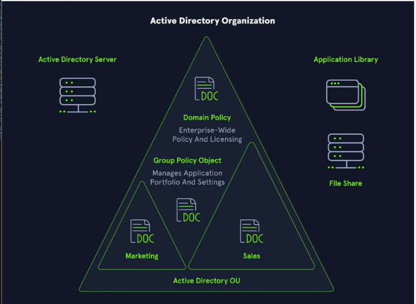

## Overview
- **Active Directory (AD)** is a **directory service** for **Windows network environments**.
- It is a **distributed, hierarchical structure** that enables **centralized management** of:
  - Users
  - Computers
  - Groups
  - Network devices
  - File shares
  - Group policies
  - Devices
  - Trusts
- AD provides **authentication and authorization** within a **Windows domain environment**.

2

## Security Concerns
- **AD is heavily attacked** because:
  - It is **backward-compatible**, making it **not secure by default**.
  - It is **easily misconfigured**.
- AD is essentially a **large read-only database** accessible by **all domain users**, even **basic users**.
  - A basic user can **enumerate most objects** in AD.
  - **Misconfigurations** can be **leveraged for lateral and vertical movement** within a network.
- Emphasizes the need for:
  - **Proper security** and **hardening**
  - **Defense-in-depth** strategies
  - **Network segmentation**
  - **Principle of least privilege**
- **Example Attack**: 
  - **noPac Attack** (Released: December 2021)

## Importance
- **95% of Fortune 500 companies** run Active Directory.
- Even a **phish attack** landing an attacker a **standard domain user account** can allow:
  - Domain **mapping**
  - **Finding attack paths**

- **Security professionals** will **encounter AD environments** throughout their careers.
- Understanding AD is critical for:
  - **Attackers**
  - **Defenders**

## Active Directory in Ransomware
- **Ransomware groups** are increasingly targeting AD.
- Example: **Conti Ransomware**
  - **400+ attacks worldwide**
  - Exploited vulnerabilities like:
    - **PrintNightmare** (CVE-2021-34527)
    - **Zerologon** (CVE-2020-1472)
- Importance of understanding AD:
  - To **identify and prevent** such vulnerabilities **before attackers do**.

## Tools and Knowledge
- Many **open-source tools** exist for **enumerating and attacking** AD.
- However, **tools are only as effective as the operator's knowledge**.
- Must understand:
  - **AD structure and function**
  - **User rights and privileges**
  - **Administration processes**

---

# History of Active Directory

## Early Origins
- **LDAP** (foundation of AD) first introduced in **RFCs around 1971**.
- Preceded by:
  - **X.500 organizational unit concept**
- **Novell Directory Services** released in **1993**.

## Active Directory Development
- AD first introduced in the **mid-90s**.
- Became part of Windows OS with **Windows Server 2000**.

### Early Windows Directory Services
- Microsoft attempted **directory services** with **Windows NT 3.0** (1990).
- Combined:
  - **LAN Manager protocol**
  - **OS/2 operating system** (Microsoft + IBM collaboration).
- Evolution:
  - Integration of **LDAP** and **Kerberos** with **Microsoft proprietary elements**.
- **First beta** of Active Directory: **1997**.

## Major Releases and Improvements
- **Windows Server 2003**:
  - Extended functionality.
  - Improved administration.
  - Introduced **Forest feature**:
    - Allows creation of **containers** for separate domains and objects.

- **Windows Server 2008**:
  - Introduced **Active Directory Federation Services (ADFS)**:
    - Provided **Single Sign-On (SSO)**.
    - Used **claims-based Access Control Authorization** model.
    - Enabled access across **organizational boundaries**.

- **Windows Server 2016**:
  - Cloud migration capabilities.
  - Security enhancements:
    - **User access monitoring**
    - **Group Managed Service Accounts (gMSA)**:
      - Secure method for running **automated tasks/services**.
      - Mitigation against **Kerberoasting attacks**.
  - Introduction of **Azure AD Connect**:
    - Single Sign-On for **Office 365 migrations**.

## Ongoing Challenges
- AD has suffered from **various misconfigurations** and **new vulnerabilities** from 2000 to today.
- Technologies interfacing with AD (e.g., **Microsoft Exchange**) also expose vulnerabilities.
- **Organizations must patch regularly** and stay updated.

- As **penetration testers**, it is crucial to:
  - **Find flaws** before attackers.
  - **Help organizations remediate vulnerabilities**.

---

# Why Learn Active Directory?

- AD knowledge is **fundamental** for:
  - **Attackers** (pentesters, red teamers)
  - **Defenders** (blue teamers, sysadmins)
- Microsoft holds a **near monopoly** in directory services.
- **On-premises AD** will continue to exist, even with cloud transitions.
- In **network penetration tests**, expect to encounter AD **almost always**.

## Benefits of Deep Understanding
- Enables confident handling of environments from **small (20 hosts)** to **large (10,000 hosts)**.
- Helps in **accurate enumeration**, **attack planning**, and **effective remediation advice**.

---

# Summary
- Active Directory is **critical** to understand due to its **widespread use** and **inherent vulnerabilities**.
- A **basic user account** can be dangerous if AD is misconfigured.
- **Multiple attacks** are possible even without elevated privileges.
- **Knowledge and understanding** of AD structure, protocols, privileges, and vulnerabilities are essential for:
  - **Effective penetration testing**
  - **Defensive hardening**
- This module will build a **strong foundation** for **manual and tool-based enumeration**, **attacks**, **lateral movement**, **post-exploitation**, and **persistence** in Active Directory environments.

