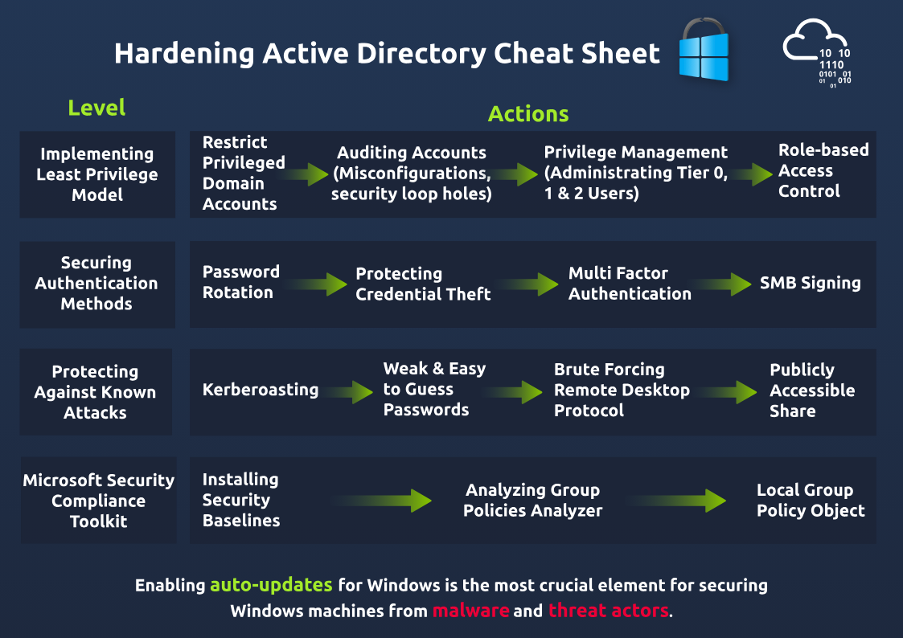

# Active Directory Hardening Notes

## Task 1: Introduction
- Active Directory (AD) is essential for managing and governing networks in large organizations.
- This room focuses on hardening AD according to best cybersecurity practices.

## Task 2: Understanding General Active Directory Concepts
### Key Concepts
- **Domain**: The core unit in AD that stores information about objects belonging to that domain.
- **Domain Controller (DC)**: The server that manages authentication and authorization within the domain.
- **Trees and Forests**:
  - **Trees**: Allow resource sharing between domains through trust relationships (one-way or two-way).
  - **Forests**: A collection of trees that share a global catalog and directory schema.

### Trust in Active Directory
- **Trusts**: Communication bridges between domains that allow resource sharing.
  - **Transitive Trusts**: Automatically extend trust to other domains.
  - **Non-Transitive Trusts**: Trust is not automatically extended.
  - **One-way Trusts**: One domain trusts another, but not vice versa.
  - **Two-way Trusts**: Both domains trust each other.

### Container and Leaves
- Objects in AD can be containers (holding other objects) or leaf objects (not holding any other objects).

### Root Domain
- **Root Domain in the attached AD machine**: `tryhackme.loc`

## Task 3: Securing Authentication Methods
### Security Policies
- **LAN Manager Hash**: Windows stores passwords using LM and NT hashes. LM hashes are weaker and should be disabled.
- **SMB Signing**: Ensures the integrity of data transmitted over the network, protecting against Man-in-the-Middle (MiTM) attacks.
- **LDAP Signing**: Requires signed LDAP requests to prevent replay and MiTM attacks.
- **Password Rotation**: Regularly changing passwords is crucial for security. Techniques include:
  - Automated scripts for password updates.
  - Implementing Multi-Factor Authentication (MFA).
  - Using Group Managed Service Accounts (gMSAs) for automatic password rotation.

### Password Policies
- **Default Minimum Password Length**: 7 characters.
- **Password Policy Settings**:
  - Enforce password history.
  - Set minimum password length (10-14 recommended).
  - Require complexity (uppercase, lowercase, digits, special characters).

## Task 4: Implementing Least Privilege Model
### Principles
- The least privilege model limits user and application access to reduce security risks.
- **Account Types**:
  - **User  Accounts**: Regular accounts for daily tasks.
  - **Privilege Accounts**: Elevated accounts for administrative tasks.
  - **Shared Accounts**: Limited use accounts, not recommended for regular use.

### Tiered Access Model
- **Tier 0**: Admin accounts and Domain Controllers.
- **Tier 1**: Domain member applications and servers.
- **Tier 2**: End-user devices (non-IT personnel).

### Questions
- **Computers and Printers must be added to Tier 0**: Nay
- **Create a high privilege account for a vendor**: Nay

## Task 5: Microsoft Security Compliance Toolkit
### Security Baselines
- Download and install security baselines from the Microsoft Security Compliance Toolkit.
- **Find and open BaselineLocalInstall script in PowerShell editor**: 
  - **Flag**: `THM{00001}`
- **Find and open MergePolicyRule script (Policy Analyser)**: 
  - **Flag**: `{THM00191}`

## Task 6: Protecting Against Known Attacks
### Common Attacks
- **Kerberoasting**: Attackers exploit Kerberos TGS to request encrypted passwords and crack them offline.
- **Weak Passwords**: Use strong passwords to prevent breaches.
- **Brute Forcing RDP**: Avoid exposing RDP to the public internet without additional security.
- **Publicly Accessible Shares**: Regularly audit shares to ensure proper access controls.

### Questions
- **Does Kerberoasting utilize an offline-attack scheme for cracking encrypted passwords**: Yea
- **Number of users with the same password as aaron.booth**: 186

## Task 7: Windows Active Directory Hardening Cheat Sheet
- Hardening AD is an ongoing process requiring collaboration between System Administrators and end-users.
- Various hardening techniques discussed in this room will help secure AD effectively.
 
### Conclusion
- This room provided an introduction to AD hardening techniques. Future rooms will delve deeper into protecting AD through group policies and implementing the least privilege model.